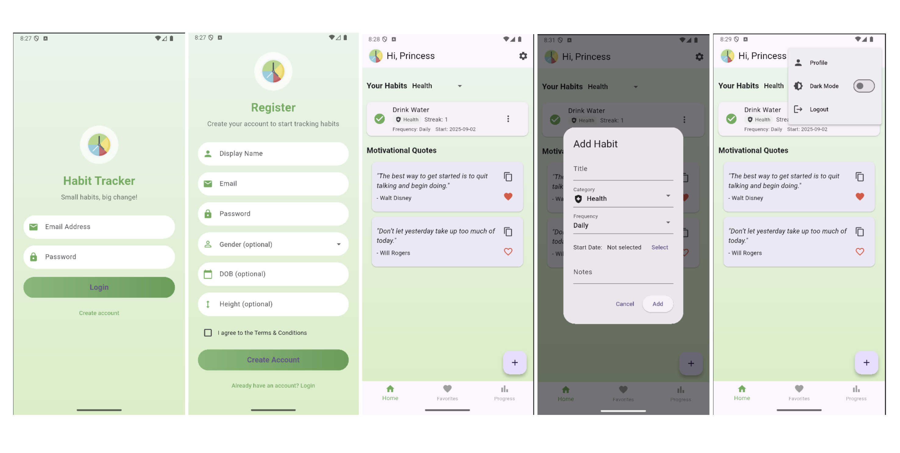
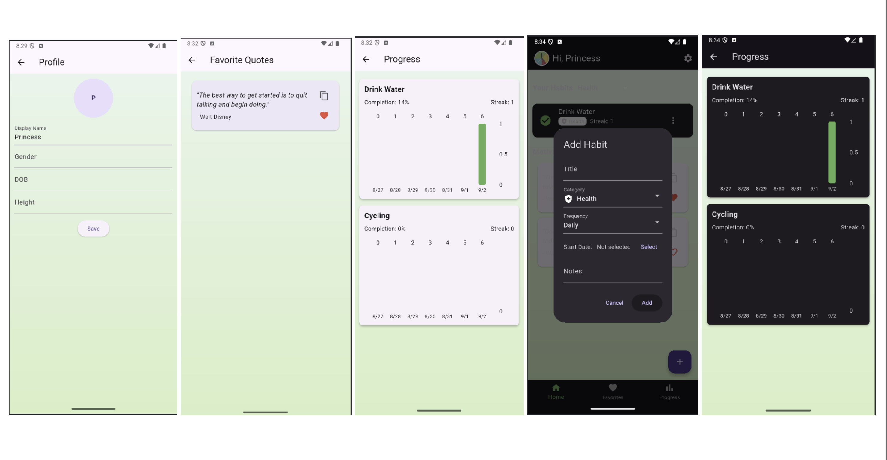
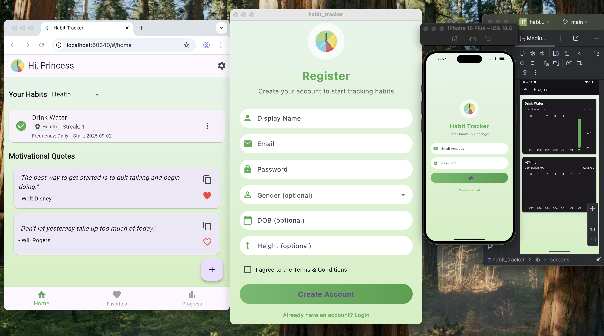

# Habit Tracker

A **Flutter habit tracker app** built using state management with `Provider`, theme persistence with `SharedPreferences` and Firebase for authentication, firestore database and real-time updates. It helps users build healthy habits, track progress, monitor streaks, receive reminders and stay motivated with daily inspirational quotes.

---

## Features Summary

### Core Features

* Login & Register using email and password
* Splash screen with login status check
* Home screen displaying user habits
* Add, edit, and delete habits
* Toggle habit completion for today
* Track habit streaks and weekly progress
* View and save motivational quotes
* Copy quotes to clipboard
* Profile management (display name, gender, DOB, height)
* Theme switching (Dark/Light)
* Notifications for habit reminders

### Additional Features

* Weekly progress visualization with bar charts
* Categorize habits (Health, Fitness, Study, Productivity, Mental Health, Others)
* Persistent login using Firebase Authentication
* Save favorite quotes to personal collection
* Organized folder structure with Provider & MVC pattern

---

## Frameworks

* **Flutter** (UI)
* **Provider** (State Management)
* **SharedPreferences** (Theme Persistence)
* **Firebase** (Authentication, Cloud Firestore, Real-time updates)
* **flutter_local_notifications** (Notifications)
* **fl_chart** (Progress visualization)

---

## App Screens

* **SplashScreen**: Checks login state and routes accordingly
* **Login/RegisterScreen**: User authentication
* **HomeScreen**: Displays habit list with completion toggles
* **Habit CRUD Dialogs**: Add, edit, delete habits
* **ProgressScreen**: Weekly habit completion bar charts
* **QuotesScreen**: Browse, copy, and favorite motivational quotes
* **ProfileScreen**: Update display name, gender, DOB, and height
* **Drawer Navigation**: Home, Progress, Quotes, Profile, Logout

---

## 📂 App Structure
```
lib
├── models
│   ├── habit.dart
│   ├── quote.dart
│   └── user_profile.dart
├── providers
│   ├── auth_provider.dart
│   ├── habits_provider.dart
│   ├── quotes_provider.dart
│   └── theme_provider.dart
├── screens
│   ├── auth
│   │   ├── login_screen.dart
│   │   └── register_screen.dart
│   ├── home
│   │   └── home_screen.dart
│   └── splash
│       └── splash_screen.dart
│   ├── favorites_screen.dart
│   ├── habits_crud_screen.dart
│   ├── profile_screen.dart
│   ├── progress_screen.dart
│   └── quotes_screen.dart
├── services
│   ├── firebase_service.dart
│   └── notification_service.dart
├── widgets
│   ├── habit_card.dart
│   └── quote_card.dart
├── firebase_options.dart
└── main.dart
```

---

## To Run The Project

### Prerequisites

- Flutter SDK >= 3.0
- Dart >= 3.0
- Firebase account
- Android Studio / Xcode for device emulation

### Run the App via Terminal

1. **Clone the repository**
```bash
git clone https://github.com/smariaa/habit_tracker.git
cd habit_tracker
flutter pub get
flutter run
```

### Dependencies
```
cupertino_icons: ^1.0.6
provider: ^6.1.5
shared_preferences: ^2.2.2
firebase_core: ^4.0.0
firebase_auth: ^6.0.1
cloud_firestore: ^6.0.0
intl: ^0.20.2
http: ^1.1.0
fl_chart: ^1.1.0
google_fonts: ^6.1.0
flutter_local_notifications: ^19.4.1
timezone: ^0.10.1
```

---

## App Screenshots





---

## References

* [https://github.com/sahuharshit408/Habit-Tracker.git](https://github.com/sahuharshit408/Habit-Tracker.git)
* [UI Idea](https://zapier.com/blog/best-habit-tracker-app/)
* [UI Idea](https://colorlib.com/wp/html5-and-css3-login-forms/)
* [Firebase Guide](https://youtu.be/T6B6sj6ZfqU?si=8RUBeptatDgxj1Zs)
* ChatGPT (Code guidance and README formatting help)
